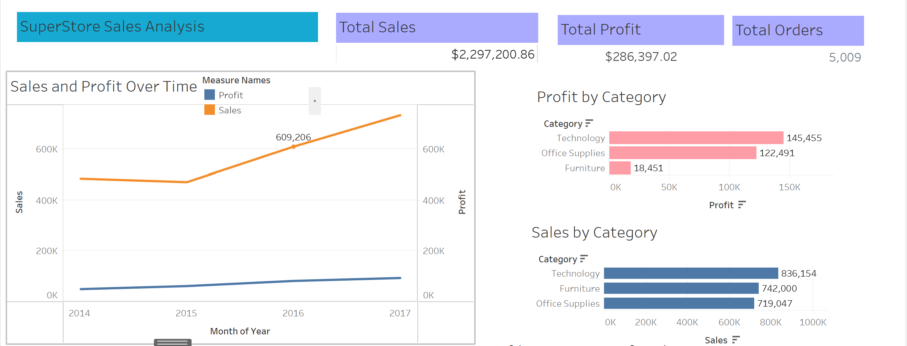

# 📈 SuperStore Sales Analysis
Project Overview:
This project helps to understand customer behaviour and sales trend in the world of e-commerce.This aims to analyze sales data to identify customer segments and provide insights to optimize sales and improve profitability for an e-commerce company.

# Dataset Description
Row ID: Unique identifier for each row
Order ID: Unique Order ID for each customer
Order Date: Order Date of the product
Ship Date: Shipping Date of the product
Ship Mode: Shipping Mode specified by the customer
Customer ID: Unique identifier for each customer
Customer Name: Name of the customer
Segment:The segment where the customer belongs
Country:Country of residence of the customer
City: City of residence of the customer
State: State of residence of the customer
Postal Code: Postal code of every customer
Region: Region where customer belongs to
Product ID: Unique ID of the Product
Category: Category of the product ordered
Sub-Category: Sub-Category of the product ordered
Product Name: Name of the product
Sales: Sales of the product
Quantity: Quantity of the product
Discount: Discount Provided
Profit: Profit earned from each sale

## 🧾 Project Summary
The objective of this project is to:
- Clean and prepare data
- Understand sales distribution across product categories and regions
- Identify profitable regions and underperforming segments
- Analyze seasonal trends in monthly sales over time

## Tools used
This analysis was done using Python (pandas, matplotlib, seaborn) and is structured to reflect a real-world business case suitable for stakeholders.

## 📂 Project Structure

├── Sample - Superstore-dataset.csv # Input dataset
├── Superstore_dataset.ipynb # Jupyter notebook with full analysis
├── README.md # Project Documentation
├── apps.py #Streamlit Dashboard

## Steps and Instructions

Install VS Code using following instructions:
Download VS Code
Go to the official VS Code website and choose the appropriate version for your operating system.

Install VS Code
Run the .exe file,follow the setup instructions, and select necessary options like adding  VS code to path.

Launch VS Code
Open VS code and perform the task

Import required libraries
import numpy as np
import pandas as pd
import matplotlib.pyplot as plt 
import seaborn as sns
from sklearn.preprocessing import LabelEncoder
from sklearn.preprocessing import MinMaxScaler
from sklearn.preprocessing import StandardScaler

## Analysis Pipeline

### 1. **Data Collection & Exploration**
- Loaded dataset using `pandas`
- Initial inspection for null values, data types, unique values

### 2. **Data Cleaning**
- Removed duplicates and unnecessary columns
- Handled missing values and outliers (e.g., in `Profit`, `Sales`)

## Summary Statistics:
Sales- The mean sales is $229.85,ranging from $0.44 to $22,638.48
Quantity- The mean quantity is 3.78,ranging from 1 to 14
Discount- The mean discount is 15.6 %,ranging from 0% to 80%
Profit- The mean profit is $28.65,ranging from $-6599.97 to $8399.97

## Dataset Shape Overview:
Complete Data: 9994 Rows, 21 Columns
This dataset provides comprehensive information about sales transactions, including customer details, product information, and financial data.

### 3. **Exploratory Data Analysis (EDA)**
- Sales & profit trends across categories and regions
- Discount vs Profit correlation
- Visualized sales by sub-category using bar plots
- KPI metrics (Total Sales, Total Profit, Total Orders)

### 4. **Feature Engineering (Optional)**
- Derived `Profitable` flag (binary)
- Created clusters using KMeans based on `Sales` and `Profit`

### 5. **Visualization**
- Built an interactive dashboard in Tableau and Streamlit
- Visual elements:
  - KPI Cards
  - Sales by Category/Sub-Category
  - Discount vs Profit
  - Regional performance

### 6. **Advanced Analysis (Optional)**
- Customer segmentation via clustering
- Predictive modeling using Random Forest (classification on profitability)

## 📊 Dashboard
A dynamic and insightful dashboard was created using Tableau and Streamlit:
- KPI cards for total sales, profit, and orders
- Regional heatmaps and bar charts
- Interactive filters for segment, category, and date

## Technologies Used
Python (Pandas, Matplotlib, Seaborn, Scikit-learn)

Jupyter Notebook

Tableau / Streamlit

Git & GitHub

## 📌 Key Insights

Office Supplies had the highest number of orders but not the highest profit.
Technology category showed strong profitability.
High discounts often led to negative profits.
Clustering identified high-value vs low-value customer segments.

## Tableau DashBoard

## Next Steps

Build a predictive model to forecast sales/profit.
Add seasonality/time series analysis.
